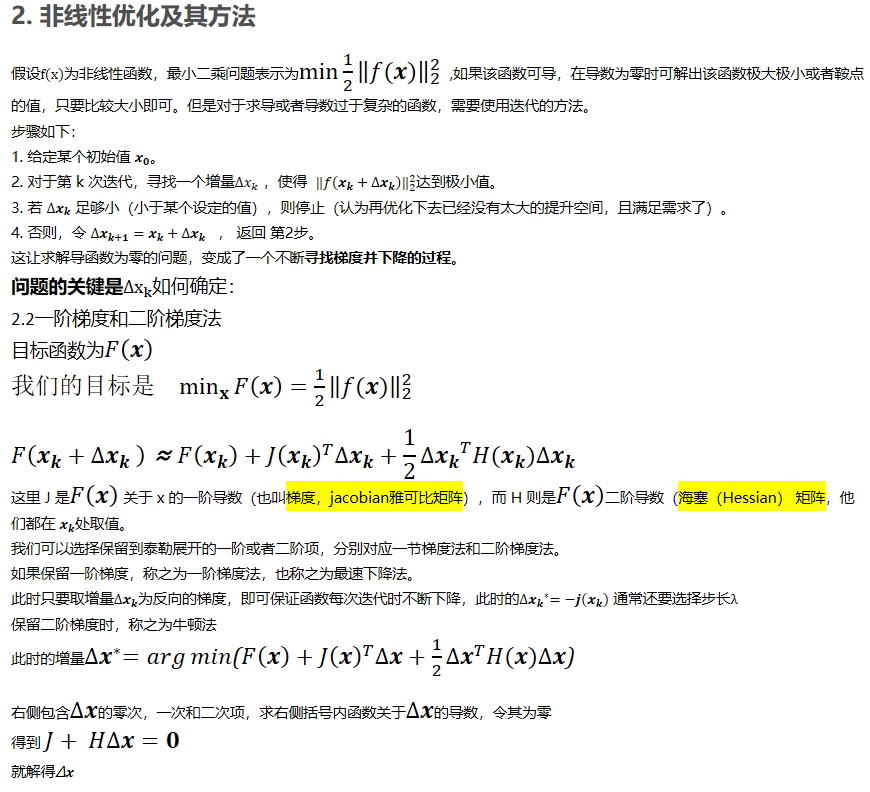
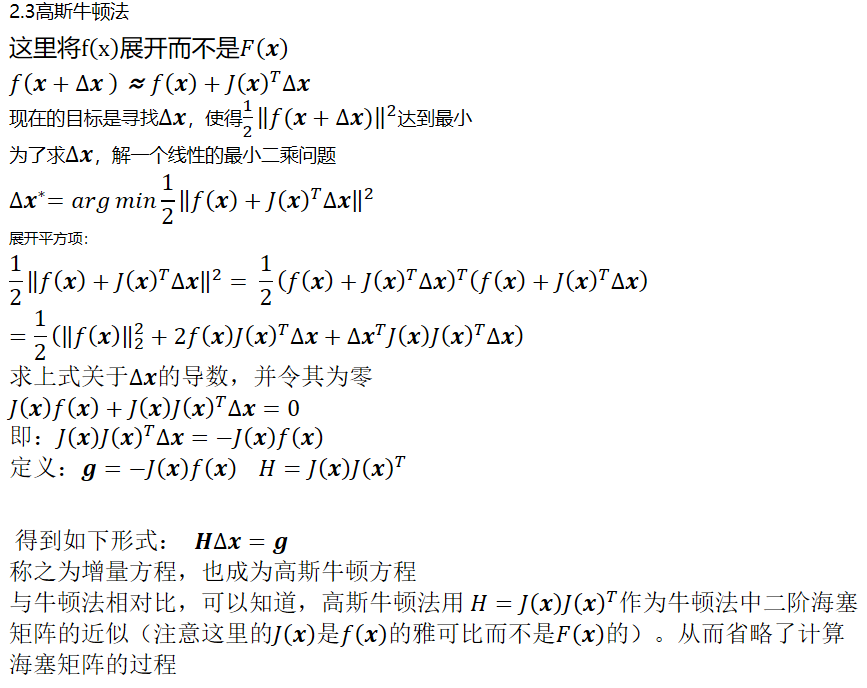
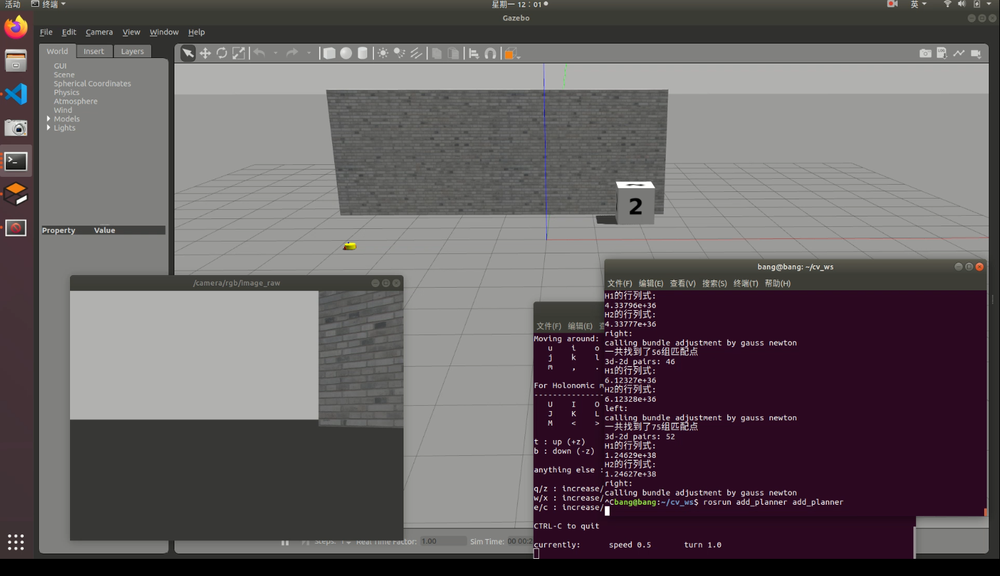
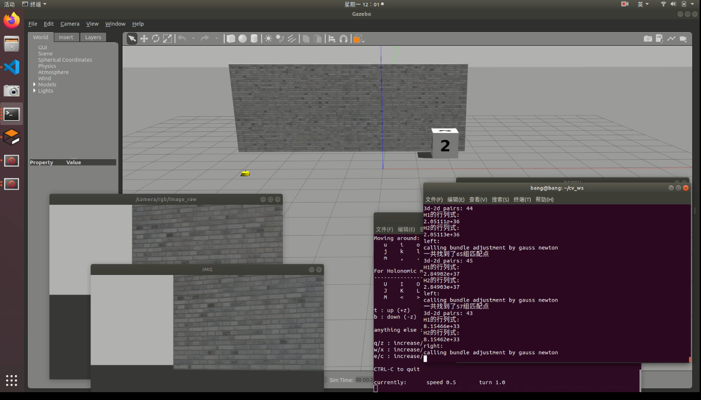

# 4.1
amcl自适应蒙特卡洛算法，使用地图信息和当前获取的激光雷达数据进行机器人定位
AMCL是Adaptive Monte Carlo Localization（也即是自适应蒙特卡洛定位）的简称，是基于多种蒙特卡洛融合算法在ROS/ROS2系统中的一种实现。
蒙特卡洛定位（MCL）基于粒子滤波算法，其一大优点是不受场景的限制，算法简捷快速，同时也可以兼顾算法的精度问题。

粒子滤波使用粒子密度（也就是单位区间内的粒子数）表征事件的发生概率。根据选定的评估方程来推算事件的置信程度，并根据该结果重新调整粒子的分布情况。经过若干次迭代之后，粒子就高度分布在可能性高的区域了。

基于这种推论，MCL将复杂的数学运算，转换成了计算机更易理解的迭代求解，在机器人定位问题上得到了很好的泛化。

如上图所示，在AMCL包中，选型、配置了运动模型、传感器模型、蒙特卡洛航位推算算法、采样算法等等功能模块。传感器模型将传感器数据结构化，运动模型将机器人的运动进行分解和代数化。传感器模型和运动模型相辅相成，紧密合作，为蒙特卡洛滤波做好数据支撑。采样/重采样算法为定位的迭代运算和误差消除提供保障。
ros中在nav模块中已经集成了AMCL相关的实现。

nav模块在前期的工作中已经配置好了。

编写launch文件将amcl集成在仿真环境中，暂时取消gmapping节点。

运行仿真环境在rviz中订阅定位信息。

运行键盘控制节点，控制机器人移动，可以发现，在机器人处于障碍物信息较为丰富的区域（拐角，棱角处），会获得相对较好的位姿估计。

# 4.2

movebase功能包

理解movebase运行框架和轨迹规划的流程。

move_base节点主要基于地图传感器等提供的环境信息、根据机器人当前的位姿和指定的规划器提供的规划算法，规划出一条有效的全局路径和运动速度命令，从而实现定点避障导航行驶的功能。

路径规划主要有下面的两大规划器组成：

全局路径规划（global_planner）：根据给定的目标位置和全局地图进行总体的路劲规划。在导航中，使用迪特斯克或者A*算法进行全局路径的规划，计算出最佳路径

本地实施规划（local_planner）：实际情况下，由于可能出现障碍物，无法完美按照全局路径规划。本地实施规划由local_planner模块实现，使用Dynamic Window Approaches算法搜索躲避障碍物行进的多条路径，综合评价标准（是否撞击障碍物，所需的时间）选取最优路径，并且计算行驶周期内的线速度和角速度，避免与动态的障碍物发生碰撞。

# 4.3

配置movebase功能包运行环境，安装依赖。进行源码编译。

在launch文件中加载movebase节点。

movebase需要订阅目标点的消息。目标点使用rviz的快捷工具发送。

# 4.4
gmapping，amcl，movebase集成，实现给定目标点的自主建图

在launch文件中集成三个节点，开启仿真环境。

通过在位置区域，给定目标点，机器人边进行路径规划，边进行自主建图

使用map-server保存地图生成本地地图文件和地图描述yaml文件。

# 4.5

复习《视觉slam14讲》关于视觉里程计和重投影误差的计算相关内容，形成笔记。
重投影误差
其实第一次投影指的就是相机在拍照的时候，三维空间点投影到图像上。
然后我们利用这些图像对一些特征点进行三角定位（triangulation），利用几何信息（对极几何） 构建三角形来确定三维空间点的位置
最后利用我们计算得到的三维点的坐标（注意不是真实的）和我们计算得到的相机位姿（当然也不是真实的）进行第二次投影，也就是重投影。
重投影误差：指的真实三维空间点在图像平面上的投影（也就是图像上的像素点）和重投影（其实是用我们的计算值得到的虚拟的像素点）的差值，
因为种种原因计算得到的值和实际情况不会完全相符，也就是这个差值不可能恰好为0，此时也就需要将这些差值的和最小化获取最优的相机位姿参数及三维空间点的坐标。

# 4.6
复习非线性优化方法
最速梯度下降法和高斯牛顿法






# 4.7

复习BA优化
Bundle Adjustment
译为光束法平差，或者束调整、捆集调整。       
所谓bundle，来源于bundle of light，其本意就是指的光束，这些光束指的是三维空间中的点投影到像平面上的光束，而重投影误差正是利用这些光束来构建的，因此称为光束法，强调光束也正是描述其优化模型是如何建立的。
测量平差：由于测量仪器的精度不完善和人为因素及外界条件的影响，测量误差总是不可避免的。为了提高成果的质量，处理好这些测量中存在的误差问题，观测值的个数往往要多于确定未知量所必须观测的个数，也就是要进行多余观测。有了多余观测，势必在观测结果之间产生矛盾，测量平差的目的就在于消除这些矛盾而求得观测量的最可靠结果并评定测量成果的精度。测量平差采用的原理就是“最小二乘法”。（通过多次测量平衡误差？）

重投影误差
其实第一次投影指的就是相机在拍照的时候，三维空间点投影到图像上。
然后我们利用这些图像对一些特征点进行三角定位（triangulation），利用几何信息（对极几何） 构建三角形来确定三维空间点的位置
最后利用我们计算得到的三维点的坐标（注意不是真实的）和我们计算得到的相机位姿（当然也不是真实的）进行第二次投影，也就是重投影。
重投影误差：指的真实三维空间点在图像平面上的投影（也就是图像上的像素点）和重投影（其实是用我们的计算值得到的虚拟的像素点）的差值，
因为种种原因计算得到的值和实际情况不会完全相符，也就是这个差值不可能恰好为0，此时也就需要将这些差值的和最小化获取最优的相机位姿参数及三维空间点的坐标。
1.重投影
相机在拍照时会把空间点投影到图像上，这是第一次投影。我们利用这些图像进行特征匹配，然后对匹配的特征点进行三角化，得到三维空间点位置（如上图中的）。最后我们利用计算得到的三维点的坐标（估计值，具有误差）和我们计算得到的相机矩阵（具有误差）进行第二次投影，也就是重投影。

BA的目的就是优化相机的位姿（变换矩阵T），使得整体误差（不是误差的代数和，是平方和，构建了最小二乘问题）最小。

# 4.10

准备组会内容，与师兄讨论算法具体实现。海塞矩阵求解以及高斯牛顿法的位姿估计实现。

感知质量的评定规则，感知质量数值的尺度如何与A*算法中其他代价项的尺度统一。

对于A*算法中出现的代价和感知质量如何结合做讨论。

制定后续的试验方案

# 4.11

确定阶段性实验环境，设定实验的环境为一侧有丰富的纹理信息，一侧空白。

在这样的环境中，使移动机器人处于合适的位置，让相机的一侧有纹理信息（特征点丰富），而另一侧纹理信息（特征点）较少

目的是用来验证海塞矩阵能否区别左右纹理信息的不同。

在gazebo中搭建仿真环境，仿真环境中为空白的世界和一面墙构成，墙体为砖头纹路材质，墙周围放置带数字的方块。


移动机器人到合适的位置，让机器人视野中一侧有纹理信息（特征点丰富），而另一侧纹理信息（特征点）较少。

# 4.12

学习《视觉slam14讲》中关于opencv图像处理的章节。

学习关于特征点的内容。

图像处理中，特征点指的是图像灰度值发生剧烈变化的点或者在图像边缘上曲率较大的点(即两个边缘的交点)。图像特征点在基于特征点的图像匹配算法中有着十分重要的作用。图像特征点能够反映图像本质特征，能够标识图像中目标物体。通过特征点的匹配能够完成图像的匹配。

纹理特征也是一种全局特征，它也描述了图像或图像区域所对应景物的表面性质。但由于纹理只是一种物体表面的特性，并不能完全反映出物体的本质属性，所以仅仅利用纹理特征是无法获得高层次图像内容的。与颜色特征不同，纹理特征不是基于像素点的特征，它需要在包含多个像素点的区域中进行统计计算。在模式匹配中，这种区域性的特征具有较大的优越性，不会由于局部的偏差而无法匹配成功。作为一种统计特征，纹理特征常具有旋转不变性，并且对于噪声有较强的抵抗能力。但是，纹理特征也有其缺点，一个很明显的缺点是当图像的分辨率变化的时候，所计算出来的纹理可能会有较大偏差。

首先，从图像中提取具有代表性的点，这些点在相机视角发生少量变化时会保持不变，于是可以在不同帧的图像中找到这些特征点。在经典slam中，我们称之为路标。而在视觉slam中，我们称之为图像特征。

特征是图像信息的另一种数字表达，特征点是图像中一些特别的地方，我们希望特征点在相机运动之后保持稳定，而灰度受到各方面的因素的影响，导致不稳定。因此需要对图像提取特征点。

图像中的角点，边缘点相比较于像素区块而言，更加特别，角点可以作为所谓的特征。角点提取算法有很多种，例如FAST角点，Harris角点，GFTT角点。

大多数应用中，仅使用单纯的角点不能满足要求，因为其不具有尺度不变性和旋转不变性。

更稳定的局部特征: SIFT、ORB、SURF等

他们具有以下的特点：

1、可重复性：相同的特征点在不同的图像中可以被找到

2、可区别性：不同的特征有不同的表达

3、高效率：同一图像中，特征点的数量应远小于像素的数量

4、本地性： 特征仅仅与一小片图像区域有关。


# 4.13

特征点由关键点和描述子组成：

关键点是指，特征点在图像中的位置。

这些特征点还具有朝向，大小等信息。描述子通常是一个认为设计的向量，描述了关键点周围像素的信息。描述子是按照外观相似的特征应该具有相似的描述子的原则设计的。

只要两个特征点的描述子在向量空间上的距离足够相近，就可以认为它们是同样的特征点。

# 4.14

ORB特征：

ORB特征由关键点和描述子两部分组成。

ORB（Oriented FAST and Rotated BRIEF）是一种快速特征点提取和描述的算法。

ORB算法分为两部分，分别是特征点提取和特征点描述。特征提取是由FAST（Features from  Accelerated Segment Test）算法发展来的，特征点描述是根据BRIEF（Binary Robust IndependentElementary Features）特征描述算法改进的。ORB特征是将FAST特征点的检测方法与BRIEF特征描述子结合起来，并在它们原来的基础上做了改进与优化。据说，ORB算法的速度是sift的100倍，是surf的10倍。

## Fast特征提取

ORB算法的特征提取是由FAST算法改进的，这里成为oFAST（FASTKeypoint Orientation）。也就是说，在使用FAST提取出特征点之后，给其定义一个特征点方向，以此来实现特征点的旋转不变形。FAST算法是公认的最快的特征点提取方法。FAST算法提取的特征点非常接近角点类型。

## rBRIEF特征描述

对前面的一部提取出的特征点周围的图像区域进行描述，rBRIEF特征描述是在BRIEF特征描述的基础上加入旋转因子改进的。

# 4.15

使用opencv和手写的ORB特征提取方法，提取两幅图像的ORB特征，并且匹配ORB特征

使用的两张图片为：


提取出来ORB特征并进行匹配，如下图所示：


代码如下：
```c++
#include <iostream>
#include <opencv2/core/core.hpp>
#include <opencv2/features2d/features2d.hpp>
#include <opencv2/highgui/highgui.hpp>
#include <chrono>

using namespace std;
using namespace cv;

int main(int argc, char **argv) {
  if (argc != 3) {
    cout << "usage: feature_extraction img1 img2" << endl;
    return 1;
  }
  //-- 读取图像
  Mat img_1 = imread(argv[1], CV_LOAD_IMAGE_COLOR);
  Mat img_2 = imread(argv[2], CV_LOAD_IMAGE_COLOR);
  assert(img_1.data != nullptr && img_2.data != nullptr);

  //-- 初始化
  std::vector<KeyPoint> keypoints_1, keypoints_2;
  Mat descriptors_1, descriptors_2;
  Ptr<FeatureDetector> detector = ORB::create();
  Ptr<DescriptorExtractor> descriptor = ORB::create();
  Ptr<DescriptorMatcher> matcher = DescriptorMatcher::create("BruteForce-Hamming");

  //-- 第一步:检测 Oriented FAST 角点位置
  chrono::steady_clock::time_point t1 = chrono::steady_clock::now();
  detector->detect(img_1, keypoints_1);
  detector->detect(img_2, keypoints_2);

  //-- 第二步:根据角点位置计算 BRIEF 描述子
  descriptor->compute(img_1, keypoints_1, descriptors_1);
  descriptor->compute(img_2, keypoints_2, descriptors_2);
  chrono::steady_clock::time_point t2 = chrono::steady_clock::now();
  chrono::duration<double> time_used = chrono::duration_cast<chrono::duration<double>>(t2 - t1);
  cout << "extract ORB cost = " << time_used.count() << " seconds. " << endl;

  Mat outimg1;
  drawKeypoints(img_1, keypoints_1, outimg1, Scalar::all(-1), DrawMatchesFlags::DEFAULT);
  imshow("ORB features", outimg1);

  //-- 第三步:对两幅图像中的BRIEF描述子进行匹配，使用 Hamming 距离
  vector<DMatch> matches;
  t1 = chrono::steady_clock::now();
  matcher->match(descriptors_1, descriptors_2, matches);
  t2 = chrono::steady_clock::now();
  time_used = chrono::duration_cast<chrono::duration<double>>(t2 - t1);
  cout << "match ORB cost = " << time_used.count() << " seconds. " << endl;

  //-- 第四步:匹配点对筛选
  // 计算最小距离和最大距离
  auto min_max = minmax_element(matches.begin(), matches.end(),
                                [](const DMatch &m1, const DMatch &m2) { return m1.distance < m2.distance; });
  double min_dist = min_max.first->distance;
  double max_dist = min_max.second->distance;

  printf("-- Max dist : %f \n", max_dist);
  printf("-- Min dist : %f \n", min_dist);

  //当描述子之间的距离大于两倍的最小距离时,即认为匹配有误.但有时候最小距离会非常小,设置一个经验值30作为下限.
  std::vector<DMatch> good_matches;
  for (int i = 0; i < descriptors_1.rows; i++) {
    if (matches[i].distance <= max(2 * min_dist, 30.0)) {
      good_matches.push_back(matches[i]);
    }
  }

  //-- 第五步:绘制匹配结果
  Mat img_match;
  Mat img_goodmatch;
  drawMatches(img_1, keypoints_1, img_2, keypoints_2, matches, img_match);
  drawMatches(img_1, keypoints_1, img_2, keypoints_2, good_matches, img_goodmatch);
  imshow("all matches", img_match);
  imshow("good matches", img_goodmatch);
  waitKey(0);

  return 0;
}
```

手写ORB特征代码如下:

```c++
#include <opencv2/opencv.hpp>
#include <string>
#include <nmmintrin.h>
#include <chrono>

using namespace std;

// global variables
string first_file = "./1.png";
string second_file = "./2.png";

// 32 bit unsigned int, will have 8, 8x32=256
typedef vector<uint32_t> DescType; // Descriptor type

/**
 * compute descriptor of orb keypoints
 * @param img input image
 * @param keypoints detected fast keypoints
 * @param descriptors descriptors
 *
 * NOTE: if a keypoint goes outside the image boundary (8 pixels), descriptors will not be computed and will be left as
 * empty
 */
void ComputeORB(const cv::Mat &img, vector<cv::KeyPoint> &keypoints, vector<DescType> &descriptors);

/**
 * brute-force match two sets of descriptors
 * @param desc1 the first descriptor
 * @param desc2 the second descriptor
 * @param matches matches of two images
 */
void BfMatch(const vector<DescType> &desc1, const vector<DescType> &desc2, vector<cv::DMatch> &matches);

int main(int argc, char **argv) {

  // load image
  cv::Mat first_image = cv::imread(first_file, 0);
  cv::Mat second_image = cv::imread(second_file, 0);
  assert(first_image.data != nullptr && second_image.data != nullptr);

  // detect FAST keypoints1 using threshold=40
  chrono::steady_clock::time_point t1 = chrono::steady_clock::now();
  vector<cv::KeyPoint> keypoints1;
  cv::FAST(first_image, keypoints1, 40);
  vector<DescType> descriptor1;
  ComputeORB(first_image, keypoints1, descriptor1);

  // same for the second
  vector<cv::KeyPoint> keypoints2;
  vector<DescType> descriptor2;
  cv::FAST(second_image, keypoints2, 40);
  ComputeORB(second_image, keypoints2, descriptor2);
  chrono::steady_clock::time_point t2 = chrono::steady_clock::now();
  chrono::duration<double> time_used = chrono::duration_cast<chrono::duration<double>>(t2 - t1);
  cout << "extract ORB cost = " << time_used.count() << " seconds. " << endl;

  // find matches
  vector<cv::DMatch> matches;
  t1 = chrono::steady_clock::now();
  BfMatch(descriptor1, descriptor2, matches);
  t2 = chrono::steady_clock::now();
  time_used = chrono::duration_cast<chrono::duration<double>>(t2 - t1);
  cout << "match ORB cost = " << time_used.count() << " seconds. " << endl;
  cout << "matches: " << matches.size() << endl;

  // plot the matches
  cv::Mat image_show;
  cv::drawMatches(first_image, keypoints1, second_image, keypoints2, matches, image_show);
  cv::imshow("matches", image_show);
  cv::imwrite("matches.png", image_show);
  cv::waitKey(0);

  cout << "done." << endl;
  return 0;
}

// -------------------------------------------------------------------------------------------------- //
// ORB pattern
int ORB_pattern[256 * 4] = {
  8, -3, 9, 5/*mean (0), correlation (0)*/,
  4, 2, 7, -12/*mean (1.12461e-05), correlation (0.0437584)*/,
  -11, 9, -8, 2/*mean (3.37382e-05), correlation (0.0617409)*/,
  7, -12, 12, -13/*mean (5.62303e-05), correlation (0.0636977)*/,
  2, -13, 2, 12/*mean (0.000134953), correlation (0.085099)*/,
  1, -7, 1, 6/*mean (0.000528565), correlation (0.0857175)*/,
  -2, -10, -2, -4/*mean (0.0188821), correlation (0.0985774)*/,
  -13, -13, -11, -8/*mean (0.0363135), correlation (0.0899616)*/,
  -13, -3, -12, -9/*mean (0.121806), correlation (0.099849)*/,
  10, 4, 11, 9/*mean (0.122065), correlation (0.093285)*/,
  -13, -8, -8, -9/*mean (0.162787), correlation (0.0942748)*/,
  -11, 7, -9, 12/*mean (0.21561), correlation (0.0974438)*/,
  7, 7, 12, 6/*mean (0.160583), correlation (0.130064)*/,
  -4, -5, -3, 0/*mean (0.228171), correlation (0.132998)*/,
  -13, 2, -12, -3/*mean (0.00997526), correlation (0.145926)*/,
  -9, 0, -7, 5/*mean (0.198234), correlation (0.143636)*/,
  12, -6, 12, -1/*mean (0.0676226), correlation (0.16689)*/,
  -3, 6, -2, 12/*mean (0.166847), correlation (0.171682)*/,
  -6, -13, -4, -8/*mean (0.101215), correlation (0.179716)*/,
  11, -13, 12, -8/*mean (0.200641), correlation (0.192279)*/,
  4, 7, 5, 1/*mean (0.205106), correlation (0.186848)*/,
  5, -3, 10, -3/*mean (0.234908), correlation (0.192319)*/,
  3, -7, 6, 12/*mean (0.0709964), correlation (0.210872)*/,
  -8, -7, -6, -2/*mean (0.0939834), correlation (0.212589)*/,
  -2, 11, -1, -10/*mean (0.127778), correlation (0.20866)*/,
  -13, 12, -8, 10/*mean (0.14783), correlation (0.206356)*/,
  -7, 3, -5, -3/*mean (0.182141), correlation (0.198942)*/,
  -4, 2, -3, 7/*mean (0.188237), correlation (0.21384)*/,
  -10, -12, -6, 11/*mean (0.14865), correlation (0.23571)*/,
  5, -12, 6, -7/*mean (0.222312), correlation (0.23324)*/,
  5, -6, 7, -1/*mean (0.229082), correlation (0.23389)*/,
  1, 0, 4, -5/*mean (0.241577), correlation (0.215286)*/,
  9, 11, 11, -13/*mean (0.00338507), correlation (0.251373)*/,
  4, 7, 4, 12/*mean (0.131005), correlation (0.257622)*/,
  2, -1, 4, 4/*mean (0.152755), correlation (0.255205)*/,
  -4, -12, -2, 7/*mean (0.182771), correlation (0.244867)*/,
  -8, -5, -7, -10/*mean (0.186898), correlation (0.23901)*/,
  4, 11, 9, 12/*mean (0.226226), correlation (0.258255)*/,
  0, -8, 1, -13/*mean (0.0897886), correlation (0.274827)*/,
  -13, -2, -8, 2/*mean (0.148774), correlation (0.28065)*/,
  -3, -2, -2, 3/*mean (0.153048), correlation (0.283063)*/,
  -6, 9, -4, -9/*mean (0.169523), correlation (0.278248)*/,
  8, 12, 10, 7/*mean (0.225337), correlation (0.282851)*/,
  0, 9, 1, 3/*mean (0.226687), correlation (0.278734)*/,
  7, -5, 11, -10/*mean (0.00693882), correlation (0.305161)*/,
  -13, -6, -11, 0/*mean (0.0227283), correlation (0.300181)*/,
  10, 7, 12, 1/*mean (0.125517), correlation (0.31089)*/,
  -6, -3, -6, 12/*mean (0.131748), correlation (0.312779)*/,
  10, -9, 12, -4/*mean (0.144827), correlation (0.292797)*/,
  -13, 8, -8, -12/*mean (0.149202), correlation (0.308918)*/,
  -13, 0, -8, -4/*mean (0.160909), correlation (0.310013)*/,
  3, 3, 7, 8/*mean (0.177755), correlation (0.309394)*/,
  5, 7, 10, -7/*mean (0.212337), correlation (0.310315)*/,
  -1, 7, 1, -12/*mean (0.214429), correlation (0.311933)*/,
  3, -10, 5, 6/*mean (0.235807), correlation (0.313104)*/,
  2, -4, 3, -10/*mean (0.00494827), correlation (0.344948)*/,
  -13, 0, -13, 5/*mean (0.0549145), correlation (0.344675)*/,
  -13, -7, -12, 12/*mean (0.103385), correlation (0.342715)*/,
  -13, 3, -11, 8/*mean (0.134222), correlation (0.322922)*/,
  -7, 12, -4, 7/*mean (0.153284), correlation (0.337061)*/,
  6, -10, 12, 8/*mean (0.154881), correlation (0.329257)*/,
  -9, -1, -7, -6/*mean (0.200967), correlation (0.33312)*/,
  -2, -5, 0, 12/*mean (0.201518), correlation (0.340635)*/,
  -12, 5, -7, 5/*mean (0.207805), correlation (0.335631)*/,
  3, -10, 8, -13/*mean (0.224438), correlation (0.34504)*/,
  -7, -7, -4, 5/*mean (0.239361), correlation (0.338053)*/,
  -3, -2, -1, -7/*mean (0.240744), correlation (0.344322)*/,
  2, 9, 5, -11/*mean (0.242949), correlation (0.34145)*/,
  -11, -13, -5, -13/*mean (0.244028), correlation (0.336861)*/,
  -1, 6, 0, -1/*mean (0.247571), correlation (0.343684)*/,
  5, -3, 5, 2/*mean (0.000697256), correlation (0.357265)*/,
  -4, -13, -4, 12/*mean (0.00213675), correlation (0.373827)*/,
  -9, -6, -9, 6/*mean (0.0126856), correlation (0.373938)*/,
  -12, -10, -8, -4/*mean (0.0152497), correlation (0.364237)*/,
  10, 2, 12, -3/*mean (0.0299933), correlation (0.345292)*/,
  7, 12, 12, 12/*mean (0.0307242), correlation (0.366299)*/,
  -7, -13, -6, 5/*mean (0.0534975), correlation (0.368357)*/,
  -4, 9, -3, 4/*mean (0.099865), correlation (0.372276)*/,
  7, -1, 12, 2/*mean (0.117083), correlation (0.364529)*/,
  -7, 6, -5, 1/*mean (0.126125), correlation (0.369606)*/,
  -13, 11, -12, 5/*mean (0.130364), correlation (0.358502)*/,
  -3, 7, -2, -6/*mean (0.131691), correlation (0.375531)*/,
  7, -8, 12, -7/*mean (0.160166), correlation (0.379508)*/,
  -13, -7, -11, -12/*mean (0.167848), correlation (0.353343)*/,
  1, -3, 12, 12/*mean (0.183378), correlation (0.371916)*/,
  2, -6, 3, 0/*mean (0.228711), correlation (0.371761)*/,
  -4, 3, -2, -13/*mean (0.247211), correlation (0.364063)*/,
  -1, -13, 1, 9/*mean (0.249325), correlation (0.378139)*/,
  7, 1, 8, -6/*mean (0.000652272), correlation (0.411682)*/,
  1, -1, 3, 12/*mean (0.00248538), correlation (0.392988)*/,
  9, 1, 12, 6/*mean (0.0206815), correlation (0.386106)*/,
  -1, -9, -1, 3/*mean (0.0364485), correlation (0.410752)*/,
  -13, -13, -10, 5/*mean (0.0376068), correlation (0.398374)*/,
  7, 7, 10, 12/*mean (0.0424202), correlation (0.405663)*/,
  12, -5, 12, 9/*mean (0.0942645), correlation (0.410422)*/,
  6, 3, 7, 11/*mean (0.1074), correlation (0.413224)*/,
  5, -13, 6, 10/*mean (0.109256), correlation (0.408646)*/,
  2, -12, 2, 3/*mean (0.131691), correlation (0.416076)*/,
  3, 8, 4, -6/*mean (0.165081), correlation (0.417569)*/,
  2, 6, 12, -13/*mean (0.171874), correlation (0.408471)*/,
  9, -12, 10, 3/*mean (0.175146), correlation (0.41296)*/,
  -8, 4, -7, 9/*mean (0.183682), correlation (0.402956)*/,
  -11, 12, -4, -6/*mean (0.184672), correlation (0.416125)*/,
  1, 12, 2, -8/*mean (0.191487), correlation (0.386696)*/,
  6, -9, 7, -4/*mean (0.192668), correlation (0.394771)*/,
  2, 3, 3, -2/*mean (0.200157), correlation (0.408303)*/,
  6, 3, 11, 0/*mean (0.204588), correlation (0.411762)*/,
  3, -3, 8, -8/*mean (0.205904), correlation (0.416294)*/,
  7, 8, 9, 3/*mean (0.213237), correlation (0.409306)*/,
  -11, -5, -6, -4/*mean (0.243444), correlation (0.395069)*/,
  -10, 11, -5, 10/*mean (0.247672), correlation (0.413392)*/,
  -5, -8, -3, 12/*mean (0.24774), correlation (0.411416)*/,
  -10, 5, -9, 0/*mean (0.00213675), correlation (0.454003)*/,
  8, -1, 12, -6/*mean (0.0293635), correlation (0.455368)*/,
  4, -6, 6, -11/*mean (0.0404971), correlation (0.457393)*/,
  -10, 12, -8, 7/*mean (0.0481107), correlation (0.448364)*/,
  4, -2, 6, 7/*mean (0.050641), correlation (0.455019)*/,
  -2, 0, -2, 12/*mean (0.0525978), correlation (0.44338)*/,
  -5, -8, -5, 2/*mean (0.0629667), correlation (0.457096)*/,
  7, -6, 10, 12/*mean (0.0653846), correlation (0.445623)*/,
  -9, -13, -8, -8/*mean (0.0858749), correlation (0.449789)*/,
  -5, -13, -5, -2/*mean (0.122402), correlation (0.450201)*/,
  8, -8, 9, -13/*mean (0.125416), correlation (0.453224)*/,
  -9, -11, -9, 0/*mean (0.130128), correlation (0.458724)*/,
  1, -8, 1, -2/*mean (0.132467), correlation (0.440133)*/,
  7, -4, 9, 1/*mean (0.132692), correlation (0.454)*/,
  -2, 1, -1, -4/*mean (0.135695), correlation (0.455739)*/,
  11, -6, 12, -11/*mean (0.142904), correlation (0.446114)*/,
  -12, -9, -6, 4/*mean (0.146165), correlation (0.451473)*/,
  3, 7, 7, 12/*mean (0.147627), correlation (0.456643)*/,
  5, 5, 10, 8/*mean (0.152901), correlation (0.455036)*/,
  0, -4, 2, 8/*mean (0.167083), correlation (0.459315)*/,
  -9, 12, -5, -13/*mean (0.173234), correlation (0.454706)*/,
  0, 7, 2, 12/*mean (0.18312), correlation (0.433855)*/,
  -1, 2, 1, 7/*mean (0.185504), correlation (0.443838)*/,
  5, 11, 7, -9/*mean (0.185706), correlation (0.451123)*/,
  3, 5, 6, -8/*mean (0.188968), correlation (0.455808)*/,
  -13, -4, -8, 9/*mean (0.191667), correlation (0.459128)*/,
  -5, 9, -3, -3/*mean (0.193196), correlation (0.458364)*/,
  -4, -7, -3, -12/*mean (0.196536), correlation (0.455782)*/,
  6, 5, 8, 0/*mean (0.1972), correlation (0.450481)*/,
  -7, 6, -6, 12/*mean (0.199438), correlation (0.458156)*/,
  -13, 6, -5, -2/*mean (0.211224), correlation (0.449548)*/,
  1, -10, 3, 10/*mean (0.211718), correlation (0.440606)*/,
  4, 1, 8, -4/*mean (0.213034), correlation (0.443177)*/,
  -2, -2, 2, -13/*mean (0.234334), correlation (0.455304)*/,
  2, -12, 12, 12/*mean (0.235684), correlation (0.443436)*/,
  -2, -13, 0, -6/*mean (0.237674), correlation (0.452525)*/,
  4, 1, 9, 3/*mean (0.23962), correlation (0.444824)*/,
  -6, -10, -3, -5/*mean (0.248459), correlation (0.439621)*/,
  -3, -13, -1, 1/*mean (0.249505), correlation (0.456666)*/,
  7, 5, 12, -11/*mean (0.00119208), correlation (0.495466)*/,
  4, -2, 5, -7/*mean (0.00372245), correlation (0.484214)*/,
  -13, 9, -9, -5/*mean (0.00741116), correlation (0.499854)*/,
  7, 1, 8, 6/*mean (0.0208952), correlation (0.499773)*/,
  7, -8, 7, 6/*mean (0.0220085), correlation (0.501609)*/,
  -7, -4, -7, 1/*mean (0.0233806), correlation (0.496568)*/,
  -8, 11, -7, -8/*mean (0.0236505), correlation (0.489719)*/,
  -13, 6, -12, -8/*mean (0.0268781), correlation (0.503487)*/,
  2, 4, 3, 9/*mean (0.0323324), correlation (0.501938)*/,
  10, -5, 12, 3/*mean (0.0399235), correlation (0.494029)*/,
  -6, -5, -6, 7/*mean (0.0420153), correlation (0.486579)*/,
  8, -3, 9, -8/*mean (0.0548021), correlation (0.484237)*/,
  2, -12, 2, 8/*mean (0.0616622), correlation (0.496642)*/,
  -11, -2, -10, 3/*mean (0.0627755), correlation (0.498563)*/,
  -12, -13, -7, -9/*mean (0.0829622), correlation (0.495491)*/,
  -11, 0, -10, -5/*mean (0.0843342), correlation (0.487146)*/,
  5, -3, 11, 8/*mean (0.0929937), correlation (0.502315)*/,
  -2, -13, -1, 12/*mean (0.113327), correlation (0.48941)*/,
  -1, -8, 0, 9/*mean (0.132119), correlation (0.467268)*/,
  -13, -11, -12, -5/*mean (0.136269), correlation (0.498771)*/,
  -10, -2, -10, 11/*mean (0.142173), correlation (0.498714)*/,
  -3, 9, -2, -13/*mean (0.144141), correlation (0.491973)*/,
  2, -3, 3, 2/*mean (0.14892), correlation (0.500782)*/,
  -9, -13, -4, 0/*mean (0.150371), correlation (0.498211)*/,
  -4, 6, -3, -10/*mean (0.152159), correlation (0.495547)*/,
  -4, 12, -2, -7/*mean (0.156152), correlation (0.496925)*/,
  -6, -11, -4, 9/*mean (0.15749), correlation (0.499222)*/,
  6, -3, 6, 11/*mean (0.159211), correlation (0.503821)*/,
  -13, 11, -5, 5/*mean (0.162427), correlation (0.501907)*/,
  11, 11, 12, 6/*mean (0.16652), correlation (0.497632)*/,
  7, -5, 12, -2/*mean (0.169141), correlation (0.484474)*/,
  -1, 12, 0, 7/*mean (0.169456), correlation (0.495339)*/,
  -4, -8, -3, -2/*mean (0.171457), correlation (0.487251)*/,
  -7, 1, -6, 7/*mean (0.175), correlation (0.500024)*/,
  -13, -12, -8, -13/*mean (0.175866), correlation (0.497523)*/,
  -7, -2, -6, -8/*mean (0.178273), correlation (0.501854)*/,
  -8, 5, -6, -9/*mean (0.181107), correlation (0.494888)*/,
  -5, -1, -4, 5/*mean (0.190227), correlation (0.482557)*/,
  -13, 7, -8, 10/*mean (0.196739), correlation (0.496503)*/,
  1, 5, 5, -13/*mean (0.19973), correlation (0.499759)*/,
  1, 0, 10, -13/*mean (0.204465), correlation (0.49873)*/,
  9, 12, 10, -1/*mean (0.209334), correlation (0.49063)*/,
  5, -8, 10, -9/*mean (0.211134), correlation (0.503011)*/,
  -1, 11, 1, -13/*mean (0.212), correlation (0.499414)*/,
  -9, -3, -6, 2/*mean (0.212168), correlation (0.480739)*/,
  -1, -10, 1, 12/*mean (0.212731), correlation (0.502523)*/,
  -13, 1, -8, -10/*mean (0.21327), correlation (0.489786)*/,
  8, -11, 10, -6/*mean (0.214159), correlation (0.488246)*/,
  2, -13, 3, -6/*mean (0.216993), correlation (0.50287)*/,
  7, -13, 12, -9/*mean (0.223639), correlation (0.470502)*/,
  -10, -10, -5, -7/*mean (0.224089), correlation (0.500852)*/,
  -10, -8, -8, -13/*mean (0.228666), correlation (0.502629)*/,
  4, -6, 8, 5/*mean (0.22906), correlation (0.498305)*/,
  3, 12, 8, -13/*mean (0.233378), correlation (0.503825)*/,
  -4, 2, -3, -3/*mean (0.234323), correlation (0.476692)*/,
  5, -13, 10, -12/*mean (0.236392), correlation (0.475462)*/,
  4, -13, 5, -1/*mean (0.236842), correlation (0.504132)*/,
  -9, 9, -4, 3/*mean (0.236977), correlation (0.497739)*/,
  0, 3, 3, -9/*mean (0.24314), correlation (0.499398)*/,
  -12, 1, -6, 1/*mean (0.243297), correlation (0.489447)*/,
  3, 2, 4, -8/*mean (0.00155196), correlation (0.553496)*/,
  -10, -10, -10, 9/*mean (0.00239541), correlation (0.54297)*/,
  8, -13, 12, 12/*mean (0.0034413), correlation (0.544361)*/,
  -8, -12, -6, -5/*mean (0.003565), correlation (0.551225)*/,
  2, 2, 3, 7/*mean (0.00835583), correlation (0.55285)*/,
  10, 6, 11, -8/*mean (0.00885065), correlation (0.540913)*/,
  6, 8, 8, -12/*mean (0.0101552), correlation (0.551085)*/,
  -7, 10, -6, 5/*mean (0.0102227), correlation (0.533635)*/,
  -3, -9, -3, 9/*mean (0.0110211), correlation (0.543121)*/,
  -1, -13, -1, 5/*mean (0.0113473), correlation (0.550173)*/,
  -3, -7, -3, 4/*mean (0.0140913), correlation (0.554774)*/,
  -8, -2, -8, 3/*mean (0.017049), correlation (0.55461)*/,
  4, 2, 12, 12/*mean (0.01778), correlation (0.546921)*/,
  2, -5, 3, 11/*mean (0.0224022), correlation (0.549667)*/,
  6, -9, 11, -13/*mean (0.029161), correlation (0.546295)*/,
  3, -1, 7, 12/*mean (0.0303081), correlation (0.548599)*/,
  11, -1, 12, 4/*mean (0.0355151), correlation (0.523943)*/,
  -3, 0, -3, 6/*mean (0.0417904), correlation (0.543395)*/,
  4, -11, 4, 12/*mean (0.0487292), correlation (0.542818)*/,
  2, -4, 2, 1/*mean (0.0575124), correlation (0.554888)*/,
  -10, -6, -8, 1/*mean (0.0594242), correlation (0.544026)*/,
  -13, 7, -11, 1/*mean (0.0597391), correlation (0.550524)*/,
  -13, 12, -11, -13/*mean (0.0608974), correlation (0.55383)*/,
  6, 0, 11, -13/*mean (0.065126), correlation (0.552006)*/,
  0, -1, 1, 4/*mean (0.074224), correlation (0.546372)*/,
  -13, 3, -9, -2/*mean (0.0808592), correlation (0.554875)*/,
  -9, 8, -6, -3/*mean (0.0883378), correlation (0.551178)*/,
  -13, -6, -8, -2/*mean (0.0901035), correlation (0.548446)*/,
  5, -9, 8, 10/*mean (0.0949843), correlation (0.554694)*/,
  2, 7, 3, -9/*mean (0.0994152), correlation (0.550979)*/,
  -1, -6, -1, -1/*mean (0.10045), correlation (0.552714)*/,
  9, 5, 11, -2/*mean (0.100686), correlation (0.552594)*/,
  11, -3, 12, -8/*mean (0.101091), correlation (0.532394)*/,
  3, 0, 3, 5/*mean (0.101147), correlation (0.525576)*/,
  -1, 4, 0, 10/*mean (0.105263), correlation (0.531498)*/,
  3, -6, 4, 5/*mean (0.110785), correlation (0.540491)*/,
  -13, 0, -10, 5/*mean (0.112798), correlation (0.536582)*/,
  5, 8, 12, 11/*mean (0.114181), correlation (0.555793)*/,
  8, 9, 9, -6/*mean (0.117431), correlation (0.553763)*/,
  7, -4, 8, -12/*mean (0.118522), correlation (0.553452)*/,
  -10, 4, -10, 9/*mean (0.12094), correlation (0.554785)*/,
  7, 3, 12, 4/*mean (0.122582), correlation (0.555825)*/,
  9, -7, 10, -2/*mean (0.124978), correlation (0.549846)*/,
  7, 0, 12, -2/*mean (0.127002), correlation (0.537452)*/,
  -1, -6, 0, -11/*mean (0.127148), correlation (0.547401)*/
};

// compute the descriptor
void ComputeORB(const cv::Mat &img, vector<cv::KeyPoint> &keypoints, vector<DescType> &descriptors) {
  const int half_patch_size = 8;
  const int half_boundary = 16;
  int bad_points = 0;
  for (auto &kp: keypoints) {
    if (kp.pt.x < half_boundary || kp.pt.y < half_boundary ||
        kp.pt.x >= img.cols - half_boundary || kp.pt.y >= img.rows - half_boundary) {
      // outside
      bad_points++;
      descriptors.push_back({});
      continue;
    }

    float m01 = 0, m10 = 0;
    for (int dx = -half_patch_size; dx < half_patch_size; ++dx) {
      for (int dy = -half_patch_size; dy < half_patch_size; ++dy) {
        uchar pixel = img.at<uchar>(kp.pt.y + dy, kp.pt.x + dx);
        m10 += dx * pixel;
        m01 += dy * pixel;
      }
    }

    // angle should be arc tan(m01/m10);
    float m_sqrt = sqrt(m01 * m01 + m10 * m10) + 1e-18; // avoid divide by zero
    float sin_theta = m01 / m_sqrt;
    float cos_theta = m10 / m_sqrt;

    // compute the angle of this point
    DescType desc(8, 0);
    for (int i = 0; i < 8; i++) {
      uint32_t d = 0;
      for (int k = 0; k < 32; k++) {
        int idx_pq = i * 32 + k;
        cv::Point2f p(ORB_pattern[idx_pq * 4], ORB_pattern[idx_pq * 4 + 1]);
        cv::Point2f q(ORB_pattern[idx_pq * 4 + 2], ORB_pattern[idx_pq * 4 + 3]);

        // rotate with theta
        cv::Point2f pp = cv::Point2f(cos_theta * p.x - sin_theta * p.y, sin_theta * p.x + cos_theta * p.y)
                         + kp.pt;
        cv::Point2f qq = cv::Point2f(cos_theta * q.x - sin_theta * q.y, sin_theta * q.x + cos_theta * q.y)
                         + kp.pt;
        if (img.at<uchar>(pp.y, pp.x) < img.at<uchar>(qq.y, qq.x)) {
          d |= 1 << k;
        }
      }
      desc[i] = d;
    }
    descriptors.push_back(desc);
  }

  cout << "bad/total: " << bad_points << "/" << keypoints.size() << endl;
}

// brute-force matching
void BfMatch(const vector<DescType> &desc1, const vector<DescType> &desc2, vector<cv::DMatch> &matches) {
  const int d_max = 40;

  for (size_t i1 = 0; i1 < desc1.size(); ++i1) {
    if (desc1[i1].empty()) continue;
    cv::DMatch m{i1, 0, 256};
    for (size_t i2 = 0; i2 < desc2.size(); ++i2) {
      if (desc2[i2].empty()) continue;
      int distance = 0;
      for (int k = 0; k < 8; k++) {
        distance += _mm_popcnt_u32(desc1[i1][k] ^ desc2[i2][k]);
      }
      if (distance < d_max && distance < m.distance) {
        m.distance = distance;
        m.trainIdx = i2;
      }
    }
    if (m.distance < d_max) {
      matches.push_back(m);
    }
  }
}

```

# 4.15

在gazebo仿真环境中，获取机器人深度相机图像

机器人的RGB图像和深度图像通过topic的形式发送。

相关topic：

[1]RGB图像：/camera/rgb/image_color

ROS数据格式：sensor_msgs/Image

OPENCV数据格式：Mat

图像尺寸：640*480

像素数据类型：8UC3

[2]深度图像：/camera/depth/image

ROS数据格式：sensor_msgs/Image

OPENCV数据格式：Mat

图像尺寸：640*480

像素数据类型：32FC1

[3]点云数据（无整合RGB）: /camera/depth/points

ROS数据格式：sensor_msgs/Image

PCL点云库数据格式：pcl::PointCloudpcl::PointXYZ

图像尺寸：有序点云，640*480

像素数据类型：double


# 4.16

由于ros中的topic图像格式和opencv中的图像格式不一致。需要对视频的格式进行转换。

转换之后的图像才可以使用opencv进行操作

常规的做法是使用cv_bridge库进行转换，将ros中的图像编码格式转换成opencv所使用的。

代码如下

## 图像接收

```c++
#include<ros/ros.h> //ros标准库头文件
#include<iostream> //C++标准输入输出库
/*
  cv_bridge中包含CvBridge库
*/
#include<cv_bridge/cv_bridge.h> 
/*
  ROS图象类型的编码函数
*/
#include<sensor_msgs/image_encodings.h> 
/*
    image_transport 头文件用来在ROS系统中的话题上发布和订阅图象消息
*/
#include<image_transport/image_transport.h> 

//OpenCV2标准头文件
#include<opencv2/core/core.hpp>
#include<opencv2/highgui/highgui.hpp>
#include<opencv2/imgproc/imgproc.hpp>
  
static const std::string INPUT = "Input"; //定义输入窗口名称
static const std::string OUTPUT = "Output"; //定义输出窗口名称
  
//定义一个转换的类
class RGB_GRAY
{
private:
    ros::NodeHandle nh_; //定义ROS句柄
    image_transport::ImageTransport it_; //定义一个image_transport实例
    image_transport::Subscriber image_sub_; //定义ROS图象接收器
    //image_transport::Publisher image_pub_; //定义ROS图象发布器
public:
    RGB_GRAY()
      :it_(nh_) //构造函数
    {
        image_sub_ = it_.subscribe("camera/rgb/image_raw", 1, &RGB_GRAY::convert_callback, this); //定义图象接受器，订阅话题是“camera/rgb/image_raw”
       // image_pub_ = it_.publishe("", 1); //定义图象发布器
        //初始化输入输出窗口
        cv::namedWindow(INPUT);
        cv::namedWindow(OUTPUT);
    }
    ~RGB_GRAY() //析构函数
    {
          cv::destroyWindow(INPUT);
          cv::destroyWindow(OUTPUT);
    }
    /*
      这是一个ROS和OpenCV的格式转换回调函数，将图象格式从sensor_msgs/Image  --->  cv::Mat
    */
    void convert_callback(const sensor_msgs::ImageConstPtr& msg) 
    {
        cv_bridge::CvImagePtr cv_ptr; // 声明一个CvImage指针的实例
  
        try
        {
            cv_ptr =  cv_bridge::toCvCopy(msg, sensor_msgs::image_encodings::RGB8); //将ROS消息中的图象信息提取，生成新cv类型的图象，复制给CvImage指针
        }
        catch(cv_bridge::Exception& e)  //异常处理
        {
            ROS_ERROR("cv_bridge exception: %s", e.what());
            return;
        }
  
        image_process(cv_ptr->image); //得到了cv::Mat类型的图象，在CvImage指针的image中，将结果传送给处理函数   
    }


    /*
        这是图象处理的主要函数，一般会把图像处理的主要程序写在这个函数中。这里的例子只是一个彩色图象到灰度图象的转化
    */
    void image_process(cv::Mat img) 
    {
        cv::Mat img_out;
       cv::cvtColor(img, img_out, CV_RGB2GRAY);  //转换成灰度图象
        if(!img.empty())
        {
        cv::imshow(INPUT, img);
        }
        if(!img_out.empty())
        {
        cv::imshow(OUTPUT, img_out);
        }
        cv::waitKey(5);
    }
};
  
//主函数
int main(int argc, char** argv)
{
    ros::init(argc, argv, "grayImage");
    RGB_GRAY obj;
    ros::spin();
}

```

## 图像发送

```c++
#include <ros/ros.h>
#include <image_transport/image_transport.h>
#include <opencv2/highgui/highgui.hpp>
#include <cv_bridge/cv_bridge.h>
#include<iostream> //C++标准输入输出库

int main(int argc, char** argv)
{
    ros::init(argc, argv, "image_publisher");
    ros::NodeHandle nh;
    image_transport::ImageTransport it_(nh);
    image_transport::Publisher image_pub_=it_.advertise("camera/rgb/image_raw", 1);
    
    cv::Mat image = cv::imread("RGB.png");
    sensor_msgs::ImagePtr msg = cv_bridge::CvImage(std_msgs::Header(), "bgr8", image).toImageMsg();
    
    ros::Rate loop_rate(5);
    while (nh.ok()) {
        image_pub_.publish(msg);
        ros::spinOnce();
        loop_rate.sleep();
    }
}
```

# 4.18

ros当中通常一个节点当中只能接收一个ros  topic 并产生回调。

学习编写程序，在一个ros node中接受两个topic，并且产生回调。

在本项目中需要同时接受深度图像的信息和RGB图像，但是这两个话题到来的时间不一定相同，程序在读取过程中的延迟和丢帧等等使得两个话题接收到的时间不一定一致。

同时接受这两个话题之后，还需要对这两个图像话题进行时间戳的同步。

方法可以使用多线程并行调用，但是这一方法较为复杂，线程之间可能有冲突。

ros当中提供了时间戳同步器message_filter库,这个库的资料很少，多方面查阅资料，仔细阅读官方文档。

经过测试message_filter库对于很多消息类型没有支持，但是对于深度图像和RGB图像都有很好的支持。

选定使用message库进行多传感器信息融合。

官方的demo代码如下
```c++
#include <message_filters/subscriber.h>
#include <message_filters/time_synchronizer.h>
#include <sensor_msgs/Image.h>
#include <sensor_msgs/CameraInfo.h>

using namespace sensor_msgs;
using namespace message_filters;

void callback(const ImageConstPtr& image, const CameraInfoConstPtr& cam_info)
{
  // Solve all of perception here...
}

int main(int argc, char** argv)
{
  ros::init(argc, argv, "vision_node");

  ros::NodeHandle nh;

  message_filters::Subscriber<Image> image_sub(nh, "image", 1);
  message_filters::Subscriber<CameraInfo> info_sub(nh, "camera_info", 1);
  TimeSynchronizer<Image, CameraInfo> sync(image_sub, info_sub, 10);
  sync.registerCallback(boost::bind(&callback, _1, _2));

  ros::spin();

  return 0;
}
```

修改之后的部分代码如下：

```c++
#include <message_filters/subscriber.h>
#include <message_filters/time_synchronizer.h>
#include <sensor_msgs/Image.h>
#include <sensor_msgs/CameraInfo.h>

#include <ros/ros.h>
#include <image_transport/image_transport.h>
#include <cv_bridge/cv_bridge.h>
#include<iostream> //C++标准输入输出库

#include<cv_bridge/cv_bridge.h> 
/*
ROS图象类型的编码函数
*/
#include<sensor_msgs/image_encodings.h> 
/*
	image_transport 头文件用来在ROS系统中的话题上发布和订阅图象消息
*/
#include<image_transport/image_transport.h> 
#include <opencv2/highgui/highgui.hpp>
#include <opencv2/core/core.hpp>
#include <opencv2/features2d/features2d.hpp>
#include <opencv2/calib3d/calib3d.hpp>
#include <Eigen/Core>
#include <g2o/core/base_vertex.h>
#include <g2o/core/base_unary_edge.h>
#include <g2o/core/sparse_optimizer.h>
#include <g2o/core/block_solver.h>
#include <g2o/core/solver.h>
#include <g2o/core/optimization_algorithm_gauss_newton.h>
#include <g2o/solvers/dense/linear_solver_dense.h>
#include <sophus/se3.hpp>
#include <chrono>

using namespace sensor_msgs;
using namespace message_filters;
using namespace std;
using namespace cv;

static const std::string INPUT_IMG = "IMG"; //定义输入窗口名称
static const std::string INPUT_DEPTH = "DEPTH"; //定义输出窗口名称


void image_process(cv::Mat img,cv::Mat img_depth) 
{

}

void callback(const ImageConstPtr& img, const ImageConstPtr& img_depth)
{
	cv_bridge::CvImagePtr img_ptr; // 声明一个CvImage指针的实例
	cv_bridge::CvImagePtr img_depth_ptr; // 声明一个CvImage指针的实例

	try
	{
		img_ptr =  cv_bridge::toCvCopy(img, sensor_msgs::image_encodings::RGB8); //将ROS消息中的图象信息提取，生成新cv类型的图象，复制给CvImage指针
		img_depth_ptr =  cv_bridge::toCvCopy(img_depth, sensor_msgs::image_encodings::TYPE_32FC1); //将ROS消息中的图象信息提取，生成新cv类型的图象，复制给CvImage指针
	}
	catch(cv_bridge::Exception& e)  //异常处理
	{
		ROS_ERROR("cv_bridge exception: %s", e.what());
		return;
	}
	image_process(img_ptr->image,img_depth_ptr->image); //得到了cv::Mat类型的图象，在CvImage指针的image中，将结果传送给处理函数 
}


int main(int argc, char** argv)
{
	ros::init(argc, argv, "vision_node");
	cv::namedWindow(INPUT_IMG);
	cv::namedWindow(INPUT_DEPTH);

	ros::NodeHandle nh;

//使用ros内置的时间同步函数，接受RGB图像和深度图像，并同步时间戳，进入回调函数
	message_filters::Subscriber<Image> image(nh, "/camera/rgb/image_raw", 1);
	message_filters::Subscriber<Image> img_depth(nh, "/camera/depth/image_raw", 1);
	TimeSynchronizer<Image, Image> sync(image, img_depth, 10);
	sync.registerCallback(boost::bind(&callback, _1, _2));


	ros::spin();

	return 0;
}
```

CmakeLists.txt

```cmake
cmake_minimum_required(VERSION 3.0.2)
project(add_planner)

## Compile as C++11, supported in ROS Kinetic and newer
# add_compile_options(-std=c++11)
list(APPEND CMAKE_MODULE_PATH ${PROJECT_SOURCE_DIR}/cmake)

## Find catkin macros and libraries
## if COMPONENTS list like find_package(catkin REQUIRED COMPONENTS xyz)
## is used, also find other catkin packages
find_package(catkin REQUIRED COMPONENTS
  roscpp
  std_msgs
  cv_bridge
  sensor_msgs
  message_filters
)
find_package( OpenCV 3 REQUIRED )
# find_package( OpenCV REQUIRED ) # use this if in OpenCV2 
find_package( G2O REQUIRED )
find_package(Sophus REQUIRED)
include_directories(
        ${catkin_INCLUDE_DIRS}
        ${OpenCV_INCLUDE_DIRS}
        ${G2O_INCLUDE_DIRS}
        ${Sophus_INCLUDE_DIRS}
        # ${OpenCV}
        "/usr/include/eigen3/"
)
add_executable(add_planner src/add_planner.cpp)
# add_executable(vel_pub src/vel_pub.cpp)
# add_executable(vel_mix src/vel_mix.cpp)


target_link_libraries(add_planner   ${catkin_LIBRARIES} ${OpenCV_LIBRARIES} ${OpenCV_LIBS}   g2o_core g2o_stuff g2o_types_sba g2o_csparse_extension)
# target_link_libraries(vel_mix   ${catkin_LIBRARIES} )

# target_link_libraries(vel_pub   ${catkin_LIBRARIES} ${OpenCV_LIBRARIES} ${OpenCV_LIBS}   g2o_core g2o_stuff g2o_types_sba g2o_csparse_extension)

```

# 4.19

调试代码，解决代码运行的bug。

代码编译不过，查阅log信息，查阅资料，发现是环境配置的问题。

ros里面使用的ros-cv_bridge版本和目前最新版本的opencv不兼容,故卸载opencv库，重新编译opencv3.2.0版本，解决opencv报错问题。

# 4.20

继续调试代码。发现g2o库和Eigen库的报错问题。

更换G2O库的版本，并且学习在cmakelists里面配置好路径信息。

使catkin make能正确的找到第三方库并且完成编译。

# 4.21

代码编译通过，修改代码细节，完善代码结构。

接受单幅图像并计算hessian矩阵以及迭代优化后估计的位姿变换

接受到的图像如下所示


代码如下所示

```c++
#include <iostream>
#include <opencv2/core/core.hpp>
#include <opencv2/features2d/features2d.hpp>
#include <opencv2/highgui/highgui.hpp>
#include <opencv2/calib3d/calib3d.hpp>
#include <Eigen/Core>
#include <g2o/core/base_vertex.h>
#include <g2o/core/base_unary_edge.h>
#include <g2o/core/sparse_optimizer.h>
#include <g2o/core/block_solver.h>
#include <g2o/core/solver.h>
#include <g2o/core/optimization_algorithm_gauss_newton.h>
#include <g2o/solvers/dense/linear_solver_dense.h>
#include <sophus/se3.hpp>
#include <chrono>

using namespace std;
using namespace cv;

void find_feature_matches(
  const Mat &img_1, const Mat &img_2,
  std::vector<KeyPoint> &keypoints_1,
  std::vector<KeyPoint> &keypoints_2,
  std::vector<DMatch> &matches);

// 像素坐标转相机归一化坐标
Point2d pixel2cam(const Point2d &p, const Mat &K);

// BA by g2o
typedef vector<Eigen::Vector2d, Eigen::aligned_allocator<Eigen::Vector2d>> VecVector2d;
typedef vector<Eigen::Vector3d, Eigen::aligned_allocator<Eigen::Vector3d>> VecVector3d;

void bundleAdjustmentG2O(
  const VecVector3d &points_3d,
  const VecVector2d &points_2d,
  const Mat &K,
  Sophus::SE3d &pose
);
// BA by gauss-newton
void bundleAdjustmentGaussNewton(
  const VecVector3d &points_3d,
  const VecVector2d &points_2d,
  const Mat &K,
  Sophus::SE3d &pose
);
int main(int argc, char **argv) {
  if (argc != 5) {
    cout << "usage: pose_estimation_3d2d img1 img2 depth1 depth2" << endl;
    return 1;
  }
  //-- 读取图像
  Mat img_1 = imread(argv[1], CV_LOAD_IMAGE_COLOR);
  Mat img_2 = imread(argv[2], CV_LOAD_IMAGE_COLOR);
  assert(img_1.data && img_2.data && "Can not load images!");

  vector<KeyPoint> keypoints_1, keypoints_2;
  vector<DMatch> matches;
  find_feature_matches(img_1, img_2, keypoints_1, keypoints_2, matches);
  cout << "一共找到了" << matches.size() << "组匹配点" << endl;

  // 建立3D点
  Mat d1 = imread(argv[3], CV_LOAD_IMAGE_UNCHANGED);       // 深度图为16位无符号数，单通道图像
  Mat K = (Mat_<double>(3, 3) << 520.9, 0, 325.1, 0, 521.0, 249.7, 0, 0, 1);
  vector<Point3f> pts_3d;
  vector<Point2f> pts_2d;
  for (DMatch m:matches) {
    ushort d = d1.ptr<unsigned short>(int(keypoints_1[m.queryIdx].pt.y))[int(keypoints_1[m.queryIdx].pt.x)];
    if (d == 0)   // bad depth
      continue;
    float dd = d / 5000.0;
    Point2d p1 = pixel2cam(keypoints_1[m.queryIdx].pt, K);
    pts_3d.push_back(Point3f(p1.x * dd, p1.y * dd, dd));
    pts_2d.push_back(keypoints_2[m.trainIdx].pt);
  }
  cout << "3d-2d pairs: " << pts_3d.size() << endl;
  chrono::steady_clock::time_point t1 = chrono::steady_clock::now();
  Mat r, t;
  solvePnP(pts_3d, pts_2d, K, Mat(), r, t, false); // 调用OpenCV 的 PnP 求解，可选择EPNP，DLS等方法
  Mat R;
  cv::Rodrigues(r, R); // r为旋转向量形式，用Rodrigues公式转换为矩阵
  chrono::steady_clock::time_point t2 = chrono::steady_clock::now();
  chrono::duration<double> time_used = chrono::duration_cast<chrono::duration<double>>(t2 - t1);
  cout << "solve pnp in opencv cost time: " << time_used.count() << " seconds." << endl;

  cout << "R=" << endl << R << endl;
  cout << "t=" << endl << t << endl;
  VecVector3d pts_3d_eigen;
  VecVector2d pts_2d_eigen;
  for (size_t i = 0; i < pts_3d.size(); ++i) {
    pts_3d_eigen.push_back(Eigen::Vector3d(pts_3d[i].x, pts_3d[i].y, pts_3d[i].z));
    pts_2d_eigen.push_back(Eigen::Vector2d(pts_2d[i].x, pts_2d[i].y));
  }
  cout << "calling bundle adjustment by gauss newton" << endl;
  //Eigen::Matrix3d Rg = Eigen::AngleAxisd(M_PI / 2, Eigen::Vector3d(0, 0, 1)).toRotationMatrix();
  Eigen::Matrix3d Rg = Eigen::AngleAxisd(0, Eigen::Vector3d(0, 0, 1)).toRotationMatrix();
  Eigen::Vector3d tg(-1,0,0);
  Sophus::SE3d  pose_gn(Rg,tg);
  t1 = chrono::steady_clock::now();
  bundleAdjustmentGaussNewton(pts_3d_eigen, pts_2d_eigen, K, pose_gn);
  t2 = chrono::steady_clock::now();
  time_used = chrono::duration_cast<chrono::duration<double>>(t2 - t1);
  cout << "solve pnp by gauss newton cost time: " << time_used.count() << " seconds." << endl;
  cout << "calling bundle adjustment by g2o" << endl;
  Sophus::SE3d pose_g2o;
  t1 = chrono::steady_clock::now();
  bundleAdjustmentG2O(pts_3d_eigen, pts_2d_eigen, K, pose_g2o);
  t2 = chrono::steady_clock::now();
  time_used = chrono::duration_cast<chrono::duration<double>>(t2 - t1);
  cout << "solve pnp by g2o cost time: " << time_used.count() << " seconds." << endl;
  return 0;
}

void find_feature_matches(const Mat &img_1, const Mat &img_2,
                          std::vector<KeyPoint> &keypoints_1,
                          std::vector<KeyPoint> &keypoints_2,
                          std::vector<DMatch> &matches) {
  //-- 初始化
  Mat descriptors_1, descriptors_2;
  // used in OpenCV3
  Ptr<FeatureDetector> detector = ORB::create();
  Ptr<DescriptorExtractor> descriptor = ORB::create();
  // use this if you are in OpenCV2
  // Ptr<FeatureDetector> detector = FeatureDetector::create ( "ORB" );
  // Ptr<DescriptorExtractor> descriptor = DescriptorExtractor::create ( "ORB" );
  Ptr<DescriptorMatcher> matcher = DescriptorMatcher::create("BruteForce-Hamming");
  //-- 第一步:检测 Oriented FAST 角点位置
  detector->detect(img_1, keypoints_1);
  detector->detect(img_2, keypoints_2);

  //-- 第二步:根据角点位置计算 BRIEF 描述子
  descriptor->compute(img_1, keypoints_1, descriptors_1);
  descriptor->compute(img_2, keypoints_2, descriptors_2);

  //-- 第三步:对两幅图像中的BRIEF描述子进行匹配，使用 Hamming 距离
  vector<DMatch> match;
  // BFMatcher matcher ( NORM_HAMMING );
  matcher->match(descriptors_1, descriptors_2, match);

  //-- 第四步:匹配点对筛选
  double min_dist = 10000, max_dist = 0;

  //找出所有匹配之间的最小距离和最大距离, 即是最相似的和最不相似的两组点之间的距离
  for (int i = 0; i < descriptors_1.rows; i++) {
    double dist = match[i].distance;
    if (dist < min_dist) min_dist = dist;
    if (dist > max_dist) max_dist = dist;
  }

  printf("-- Max dist : %f \n", max_dist);
  printf("-- Min dist : %f \n", min_dist);

  //当描述子之间的距离大于两倍的最小距离时,即认为匹配有误.但有时候最小距离会非常小,设置一个经验值30作为下限.
  for (int i = 0; i < descriptors_1.rows; i++) {
    if (match[i].distance <= max(2 * min_dist, 30.0)) {
      matches.push_back(match[i]);
    }
  }
}

Point2d pixel2cam(const Point2d &p, const Mat &K) {
  return Point2d
    (
      (p.x - K.at<double>(0, 2)) / K.at<double>(0, 0),
      (p.y - K.at<double>(1, 2)) / K.at<double>(1, 1)
    );
}

void bundleAdjustmentGaussNewton(
  const VecVector3d &points_3d,
  const VecVector2d &points_2d,
  const Mat &K,
  Sophus::SE3d &pose) {
  typedef Eigen::Matrix<double, 6, 1> Vector6d;
  const int iterations = 10;
  double cost = 0, lastCost = 0;
  double fx = K.at<double>(0, 0);
  double fy = K.at<double>(1, 1);
  double cx = K.at<double>(0, 2);
  double cy = K.at<double>(1, 2);

  for (int iter = 0; iter < iterations; iter++) {
    Eigen::Matrix<double, 6, 6> H = Eigen::Matrix<double, 6, 6>::Zero();
    Vector6d b = Vector6d::Zero();

    cost = 0;
    // compute cost
    for (int i = 0; i < points_3d.size(); i++) {
      Eigen::Vector3d pc = pose * points_3d[i];
      double inv_z = 1.0 / pc[2];
      double inv_z2 = inv_z * inv_z;
      Eigen::Vector2d proj(fx * pc[0] / pc[2] + cx, fy * pc[1] / pc[2] + cy);

      Eigen::Vector2d e = points_2d[i] - proj;

      cost += e.squaredNorm();
      Eigen::Matrix<double, 2, 6> J;
      J << -fx * inv_z,
        0,
        fx * pc[0] * inv_z2,
        fx * pc[0] * pc[1] * inv_z2,
        -fx - fx * pc[0] * pc[0] * inv_z2,
        fx * pc[1] * inv_z,
        0,
        -fy * inv_z,
        fy * pc[1] * inv_z2,
        fy + fy * pc[1] * pc[1] * inv_z2,
        -fy * pc[0] * pc[1] * inv_z2,
        -fy * pc[0] * inv_z;

      H += J.transpose() * J;
      b += -J.transpose() * e;
    }

    Vector6d dx;
    dx = H.ldlt().solve(b);

    if (isnan(dx[0])) {
      cout << "result is nan!" << endl;
      break;
    }

    if (iter > 0 && cost >= lastCost) {
      // cost increase, update is not good
      cout << "cost: " << cost << ", last cost: " << lastCost << endl;
      break;
    }

    // update your estimation
    pose = Sophus::SE3d::exp(dx) * pose;
    lastCost = cost;

    cout << "iteration " << iter << " cost=" << std::setprecision(12) << cost << endl;
    cout<<"H:"<< H <<endl;
    cout<<"H的行列式："<< H.determinant()<<endl;

    if (dx.norm() < 1e-6) {
      // converge
      break;
    }
  }

  cout << "pose by g-n: \n" << pose.matrix() << endl;
}
/// vertex and edges used in g2o ba
class VertexPose : public g2o::BaseVertex<6, Sophus::SE3d> {
public:
  EIGEN_MAKE_ALIGNED_OPERATOR_NEW;

  virtual void setToOriginImpl() override {
    _estimate = Sophus::SE3d();
  }

  /// left multiplication on SE3
  virtual void oplusImpl(const double *update) override {
    Eigen::Matrix<double, 6, 1> update_eigen;
    update_eigen << update[0], update[1], update[2], update[3], update[4], update[5];
    _estimate = Sophus::SE3d::exp(update_eigen) * _estimate;
  }

  virtual bool read(istream &in) override {}

  virtual bool write(ostream &out) const override {}
};

class EdgeProjection : public g2o::BaseUnaryEdge<2, Eigen::Vector2d, VertexPose> {
public:
  EIGEN_MAKE_ALIGNED_OPERATOR_NEW;
  EdgeProjection(const Eigen::Vector3d &pos, const Eigen::Matrix3d &K) : _pos3d(pos), _K(K) {}
  virtual void computeError() override {
    const VertexPose *v = static_cast<VertexPose *> (_vertices[0]);
    Sophus::SE3d T = v->estimate();
    Eigen::Vector3d pos_pixel = _K * (T * _pos3d);
    pos_pixel /= pos_pixel[2];
    _error = _measurement - pos_pixel.head<2>();
  }
  virtual void linearizeOplus() override {
    const VertexPose *v = static_cast<VertexPose *> (_vertices[0]);
    Sophus::SE3d T = v->estimate();
    Eigen::Vector3d pos_cam = T * _pos3d;
    double fx = _K(0, 0);
    double fy = _K(1, 1);
    double cx = _K(0, 2);
    double cy = _K(1, 2);
    double X = pos_cam[0];
    double Y = pos_cam[1];
    double Z = pos_cam[2];
    double Z2 = Z * Z;
    _jacobianOplusXi
      << -fx / Z, 0, fx * X / Z2, fx * X * Y / Z2, -fx - fx * X * X / Z2, fx * Y / Z,
      0, -fy / Z, fy * Y / (Z * Z), fy + fy * Y * Y / Z2, -fy * X * Y / Z2, -fy * X / Z;
  }
  virtual bool read(istream &in) override {}

  virtual bool write(ostream &out) const override {}
private:
  Eigen::Vector3d _pos3d;
  Eigen::Matrix3d _K;
};

void bundleAdjustmentG2O(
  const VecVector3d &points_3d,
  const VecVector2d &points_2d,
  const Mat &K,
  Sophus::SE3d &pose) {
  // 构建图优化，先设定g2o
  typedef g2o::BlockSolver<g2o::BlockSolverTraits<6, 3>> BlockSolverType;  // pose is 6, landmark is 3
  typedef g2o::LinearSolverDense<BlockSolverType::PoseMatrixType> LinearSolverType; // 线性求解器类型
  // 梯度下降方法，可以从GN, LM, DogLeg 中选
  auto solver = new g2o::OptimizationAlgorithmGaussNewton(
    g2o::make_unique<BlockSolverType>(g2o::make_unique<LinearSolverType>()));
  g2o::SparseOptimizer optimizer;     // 图模型
  optimizer.setAlgorithm(solver);   // 设置求解器
  optimizer.setVerbose(true);       // 打开调试输出
  // vertex
  VertexPose *vertex_pose = new VertexPose(); // camera vertex_pose
  vertex_pose->setId(0);
  vertex_pose->setEstimate(Sophus::SE3d());
  optimizer.addVertex(vertex_pose);
  // K
  Eigen::Matrix3d K_eigen;
  K_eigen <<
          K.at<double>(0, 0), K.at<double>(0, 1), K.at<double>(0, 2),
    K.at<double>(1, 0), K.at<double>(1, 1), K.at<double>(1, 2),
    K.at<double>(2, 0), K.at<double>(2, 1), K.at<double>(2, 2);
  // edges
  int index = 1;
  for (size_t i = 0; i < points_2d.size(); ++i) {
    auto p2d = points_2d[i];
    auto p3d = points_3d[i];
    EdgeProjection *edge = new EdgeProjection(p3d, K_eigen);
    edge->setId(index);
    edge->setVertex(0, vertex_pose);
    edge->setMeasurement(p2d);
    edge->setInformation(Eigen::Matrix2d::Identity());
    optimizer.addEdge(edge);
    index++;
  }
	Eigen::Matrix<double, 6, 6, 0> h1;

  chrono::steady_clock::time_point t1 = chrono::steady_clock::now();
  optimizer.setVerbose(true);
  optimizer.initializeOptimization();
  optimizer.optimize(10);
  chrono::steady_clock::time_point t2 = chrono::steady_clock::now();
  chrono::duration<double> time_used = chrono::duration_cast<chrono::duration<double>>(t2 - t1);
  cout << "optimization costs time: " << time_used.count() << " seconds." << endl;
  cout << "pose estimated by g2o =\n" << vertex_pose->estimate().matrix() << endl;
    h1 = vertex_pose->A();
  cout<<"hessian:"<<h1<<endl;
  pose = vertex_pose->estimate();
}

```

计算得到的海塞矩阵的行列式和其他输出信息如下：


# 4.22

优化代码，多次实验验证计算得到的位姿估计是否准确。

更换多个实验环境和小车的位姿。分别截取图像。

对图像左侧和右侧的纹理信息不同的情况。验证通过hessian矩阵的行列式是否能正确区分左右两个位姿对于当前位置估计的不确定性大小。

# 4.23

 对于海塞矩阵能否评价纹理信息是否丰富，对于当前位置的估计是否有利这一项实验已经验证完成。

 得出结论：在纹理信息丰富的区域，从那里作为进行迭代优化的起点，可以得到更好的位姿，优化结果，并且得到较大的海塞矩阵行列式。这对于优化当前位姿是非常有利的。
 
 通过不同位置优化的海塞矩阵进行判断那一区域纹理信息丰富，就可以评定当前位置的不确定性，进而判断下一步的轨迹方向。

 # 4.24

 编写代码，将前期所有的工作进行综合。

 包括一下几点：

1、 订阅仿真环境中机器人发布的topic信息，RGB图像和深度图像

2、对拿到的图像进行时间戳的同步

3、对于时间戳相同的RGB和深度图像，进入回调，在回调函数中进行图像的格式转换。

4、转换后的RGB图像和深度图像，提取ORB特征，进行特征匹配，删除不良的特征点，进行特征匹配。建立3D点和2D点的对应。

5、将3D点和2D点，以及采样点位姿送至迭代器，使用g2o或者手写高斯牛顿法进行优化迭代

6、选取合适的迭代停止条件，计算得到优化后的位姿。计算迭代停止时的海塞矩阵，计算其行列式。

7、比较分别使用两个采样点计算的结果。控制小车运动。

# 4.24

继续编写代码，完成上述目标。

# 4.25

继续编写代码，完成上述目标。

# 4.26

核心代码已经完成，对代码进行优化。

```c++
#include <message_filters/subscriber.h>
#include <message_filters/time_synchronizer.h>
#include <sensor_msgs/Image.h>
#include <sensor_msgs/CameraInfo.h>
#include <geometry_msgs/Twist.h>
#include <ros/ros.h>
#include <image_transport/image_transport.h>
#include <cv_bridge/cv_bridge.h>
#include<iostream> //C++标准输入输出库

#include<cv_bridge/cv_bridge.h> 
/*
ROS图象类型的编码函数
*/
#include<sensor_msgs/image_encodings.h> 
/*
    image_transport 头文件用来在ROS系统中的话题上发布和订阅图象消息
*/
#include<image_transport/image_transport.h> 
#include <opencv2/highgui/highgui.hpp>
#include <opencv2/core/core.hpp>
#include <opencv2/features2d/features2d.hpp>
#include <opencv2/calib3d/calib3d.hpp>
#include <Eigen/Core>
#include <g2o/core/base_vertex.h>
#include <g2o/core/base_unary_edge.h>
#include <g2o/core/sparse_optimizer.h>
#include <g2o/core/block_solver.h>
#include <g2o/core/solver.h>
#include <g2o/core/optimization_algorithm_gauss_newton.h>
#include <g2o/solvers/dense/linear_solver_dense.h>
#include <sophus/se3.hpp>
#include <chrono>

using namespace sensor_msgs;
using namespace message_filters;
using namespace std;
using namespace cv;

static const std::string INPUT_IMG = "IMG"; //定义输入窗口名称
static const std::string INPUT_DEPTH = "DEPTH"; //定义输出窗口名称

	ros::Publisher add_vel_pub;
  geometry_msgs::Twist vel_msg;


void find_feature_matches(
    const Mat &img_1, const Mat &img_2,
    std::vector<KeyPoint> &keypoints_1,
    std::vector<KeyPoint> &keypoints_2,
    std::vector<DMatch> &matches);

// 像素坐标转相机归一化坐标
Point2d pixel2cam(const Point2d &p, const Mat &K);

// BA by g2o
typedef vector<Eigen::Vector2d, Eigen::aligned_allocator<Eigen::Vector2d>> VecVector2d;
typedef vector<Eigen::Vector3d, Eigen::aligned_allocator<Eigen::Vector3d>> VecVector3d;

void bundleAdjustmentG2O(
    const VecVector3d &points_3d,
    const VecVector2d &points_2d,
    const Mat &K,
    Sophus::SE3d &pose1,
    Sophus::SE3d &pose2
);
// BA by gauss-newton
void bundleAdjustmentGaussNewton(
  const VecVector3d &points_3d,
  const VecVector2d &points_2d,
  const Mat &K,
  Sophus::SE3d &pose
);

void image_process(cv::Mat img,cv::Mat img_depth) 
{

    if(!img.empty())
    {
    cv::imshow(INPUT_IMG, img);
    }
    if(!img_depth.empty())
    {
    cv::imshow(INPUT_DEPTH, img_depth);
    }
    cv::waitKey(5);
    
      //-- 读取图像
    cv::Mat img_1 = img;
    cv::Mat img_2 = img;
    assert(img_1.data && img_2.data && "Can not load images!");

    vector<KeyPoint> keypoints_1, keypoints_2;
    vector<DMatch> matches;
    find_feature_matches(img_1, img_2, keypoints_1, keypoints_2, matches);
    cout << "一共找到了" << matches.size() << "组匹配点" << endl;

  // 建立3D点
    Mat d1 =img_depth;
    Mat K = (Mat_<double>(3, 3) << 520.9, 0, 325.1, 0, 521.0, 249.7, 0, 0, 1);
    vector<Point3f> pts_3d;
    vector<Point2f> pts_2d;
    for (DMatch m:matches) {
    ushort d = d1.ptr<unsigned short>(int(keypoints_1[m.queryIdx].pt.y))[int(keypoints_1[m.queryIdx].pt.x)];
    if (d == 0)   // bad depth
    continue;
    float dd = d / 5000.0;
    Point2d p1 = pixel2cam(keypoints_1[m.queryIdx].pt, K);
    pts_3d.push_back(Point3f(p1.x * dd, p1.y * dd, dd));
    pts_2d.push_back(keypoints_2[m.trainIdx].pt);
    } 
    cout << "3d-2d pairs: " << pts_3d.size() << endl;

    VecVector3d pts_3d_eigen;
    VecVector2d pts_2d_eigen;
    for (size_t i = 0; i < pts_3d.size(); ++i) {
    pts_3d_eigen.push_back(Eigen::Vector3d(pts_3d[i].x, pts_3d[i].y, pts_3d[i].z));
    pts_2d_eigen.push_back(Eigen::Vector2d(pts_2d[i].x, pts_2d[i].y));
  }

    // cout << "calling bundle adjustment by g2o" << endl;
    // Sophus::SE3d pose_g2o;
    // Eigen::Matrix3d Rg = Eigen::AngleAxisd(M_PI / 4, Eigen::Vector3d(0, 0, 1)).toRotationMatrix();
    Eigen::Vector3d tg(0,0,0);

    Eigen::Matrix3d Rg_l = Eigen::AngleAxisd(M_PI / 4, Eigen::Vector3d(0, 0, 1)).toRotationMatrix();
    Eigen::Matrix3d Rg_r = Eigen::AngleAxisd(-M_PI / 4, Eigen::Vector3d(0, 0, 1)).toRotationMatrix();

    // Eigen::Vector3d tg_l(1,0,0);
    // Eigen::Vector3d tg_r(-1,0,0);
    Sophus::SE3d  pose_l(Rg_l,tg);
    Sophus::SE3d  pose_r(Rg_r,tg);

    bundleAdjustmentG2O(pts_3d_eigen, pts_2d_eigen, K, pose_l,pose_r);


  cout << "calling bundle adjustment by gauss newton" << endl;

  // // t1 = chrono::steady_clock::now();
  // bundleAdjustmentGaussNewton(pts_3d_eigen, pts_2d_eigen, K, pose_l);
  // bundleAdjustmentGaussNewton(pts_3d_eigen, pts_2d_eigen, K, pose_r);
  // // t2 = chrono::steady_clock::now();
  // // time_used = chrono::duration_cast<chrono::duration<double>>(t2 - t1);
  // // cout << "solve pnp by gauss newton cost time: " << time_used.count() << " seconds." << endl;

}

void callback(const ImageConstPtr& img, const ImageConstPtr& img_depth)
{
    cv_bridge::CvImagePtr img_ptr; // 声明一个CvImage指针的实例
    cv_bridge::CvImagePtr img_depth_ptr; // 声明一个CvImage指针的实例

    try
    {
        img_ptr =  cv_bridge::toCvCopy(img, sensor_msgs::image_encodings::RGB8); //将ROS消息中的图象信息提取，生成新cv类型的图象，复制给CvImage指针
        img_depth_ptr =  cv_bridge::toCvCopy(img_depth, sensor_msgs::image_encodings::TYPE_32FC1); //将ROS消息中的图象信息提取，生成新cv类型的图象，复制给CvImage指针
    }
    catch(cv_bridge::Exception& e)  //异常处理
    {
        ROS_ERROR("cv_bridge exception: %s", e.what());
        return;
    }
    image_process(img_ptr->image,img_depth_ptr->image); //得到了cv::Mat类型的图象，在CvImage指针的image中，将结果传送给处理函数 
}


int main(int argc, char** argv)
{
    ros::init(argc, argv, "vision_node");
    cv::namedWindow(INPUT_IMG);
    cv::namedWindow(INPUT_DEPTH);

    ros::NodeHandle nh;

  add_vel_pub = nh.advertise<geometry_msgs::Twist>("/cmd_vel_add", 10);

//使用ros内置的时间同步函数，接受RGB图像和深度图像，并同步时间戳，进入回调函数
    message_filters::Subscriber<Image> image(nh, "/camera/rgb/image_raw", 1);
    message_filters::Subscriber<Image> img_depth(nh, "/camera/depth/image_raw", 1);
    TimeSynchronizer<Image, Image> sync(image, img_depth, 10);
    sync.registerCallback(boost::bind(&callback, _1, _2));

    ros::spin();

    return 0;
}


/// vertex and edges used in g2o ba
class VertexPose : public g2o::BaseVertex<6, Sophus::SE3d> {
public:
    EIGEN_MAKE_ALIGNED_OPERATOR_NEW;

virtual void setToOriginImpl() override {
    _estimate = Sophus::SE3d();
}

  /// left multiplication on SE3
  virtual void oplusImpl(const double *update) override {
    Eigen::Matrix<double, 6, 1> update_eigen;
    update_eigen << update[0], update[1], update[2], update[3], update[4], update[5];
    _estimate = Sophus::SE3d::exp(update_eigen) * _estimate;
}

    virtual bool read(istream &in) override {}

    virtual bool write(ostream &out) const override {}
};

class EdgeProjection : public g2o::BaseUnaryEdge<2, Eigen::Vector2d, VertexPose> {
public:
    EIGEN_MAKE_ALIGNED_OPERATOR_NEW;

    EdgeProjection(const Eigen::Vector3d &pos, const Eigen::Matrix3d &K) : _pos3d(pos), _K(K) {}

    virtual void computeError() override {
        const VertexPose *v = static_cast<VertexPose *> (_vertices[0]);
        Sophus::SE3d T = v->estimate();
        Eigen::Vector3d pos_pixel = _K * (T * _pos3d);
        pos_pixel /= pos_pixel[2];
        _error = _measurement - pos_pixel.head<2>();
    }

    virtual void linearizeOplus() override {
        const VertexPose *v = static_cast<VertexPose *> (_vertices[0]);
        Sophus::SE3d T = v->estimate();
        Eigen::Vector3d pos_cam = T * _pos3d;
        double fx = _K(0, 0);
        double fy = _K(1, 1);
        double cx = _K(0, 2);
        double cy = _K(1, 2);
        double X = pos_cam[0];
        double Y = pos_cam[1];
        double Z = pos_cam[2];
        double Z2 = Z * Z;
        _jacobianOplusXi
        << -fx / Z, 0, fx * X / Z2, fx * X * Y / Z2, -fx - fx * X * X / Z2, fx * Y / Z,
        0, -fy / Z, fy * Y / (Z * Z), fy + fy * Y * Y / Z2, -fy * X * Y / Z2, -fy * X / Z;
    }

    virtual bool read(istream &in) override {}

    virtual bool write(ostream &out) const override {}

private:
    Eigen::Vector3d _pos3d;
    Eigen::Matrix3d _K;
};

void bundleAdjustmentG2O(
    const VecVector3d &points_3d,
    const VecVector2d &points_2d,
    const Mat &K,
    Sophus::SE3d &pose1,
    Sophus::SE3d &pose2) {

  // 构建图优化，先设定g2o
    typedef g2o::BlockSolver<g2o::BlockSolverTraits<6, 3>> BlockSolverType;  // pose is 6, landmark is 3
    typedef g2o::LinearSolverDense<BlockSolverType::PoseMatrixType> LinearSolverType; // 线性求解器类型
  // 梯度下降方法，可以从GN, LM, DogLeg 中选
    auto solver = new g2o::OptimizationAlgorithmGaussNewton(
    g2o::make_unique<BlockSolverType>(g2o::make_unique<LinearSolverType>()));
    g2o::SparseOptimizer optimizer;     // 图模型
    optimizer.setAlgorithm(solver);   // 设置求解器
    optimizer.setVerbose(true);       // 打开调试输出

  // vertex
  VertexPose *vertex_pose = new VertexPose(); // camera vertex_pose
    vertex_pose->setId(0);
    // vertex_pose->setEstimate(Sophus::SE3d());
    vertex_pose->setEstimate(pose1);


    optimizer.addVertex(vertex_pose);

  // K
    Eigen::Matrix3d K_eigen;
    K_eigen <<
    K.at<double>(0, 0), K.at<double>(0, 1), K.at<double>(0, 2),
    K.at<double>(1, 0), K.at<double>(1, 1), K.at<double>(1, 2),
    K.at<double>(2, 0), K.at<double>(2, 1), K.at<double>(2, 2);

  // edges
    int index = 1;
    if (points_2d.size()>=20)
    {
                  for (size_t i = 0; i < points_2d.size(); ++i) {
                  auto p2d = points_2d[i];
                  auto p3d = points_3d[i];
                  EdgeProjection *edge = new EdgeProjection(p3d, K_eigen);
                  edge->setId(index);
                  edge->setVertex(0, vertex_pose);
                  edge->setMeasurement(p2d);
                  edge->setInformation(Eigen::Matrix2d::Identity());
                  optimizer.addEdge(edge);
                  index++;
                  }
                Eigen::Matrix<double, 6, 6, 0> h1;

                  // chrono::steady_clock::time_point t1 = chrono::steady_clock::now();
                  optimizer.setVerbose(false);
                  optimizer.initializeOptimization();
                  // optimizer.optimize(1);
                  // chrono::steady_clock::time_point t2 = chrono::steady_clock::now();
                  // chrono::duration<double> time_used = chrono::duration_cast<chrono::duration<double>>(t2 - t1);
                  // cout << "optimization costs time: " << time_used.count() << " seconds." << endl;
                  // cout << "pose estimated by g2o =\n" << vertex_pose->estimate().matrix() << endl;

                  if(optimizer.optimize ( 1)==-1) 
                  {  
                      h1=Eigen::Matrix<double ,6,6,0>::Constant(0);
                  }
                  //chrono::steady_clock::time_point t2 = chrono::steady_clock::now();
                  //chrono::duration<double> time_used = chrono::duration_cast<chrono::duration<double>> ( t2-t1 );
                  //cout<<"optimization costs time: "<<time_used.count() <<" seconds."<<endl;
                  //cout<<endl<<"after optimization:"<<endl;
                  else 
                      h1=vertex_pose->A();

                  // h1 = vertex_pose->A();
                  // cout<<"hessian:"<<h1<<endl;
                  // pose = vertex_pose->estimate();
                  double h1det = h1.determinant();
                  cout<<"H1的行列式:"<<endl;
                  cout<<h1det<<endl;

                Eigen::Matrix<double, 6, 6, 0> h2;


                  vertex_pose->setEstimate(pose2);
                // edges
                  index = 1;
                  for (size_t i = 0; i < points_2d.size(); ++i) {
                  auto p2d = points_2d[i];
                  auto p3d = points_3d[i];
                  EdgeProjection *edge = new EdgeProjection(p3d, K_eigen);
                  edge->setId(index);
                  edge->setVertex(0, vertex_pose);
                  edge->setMeasurement(p2d);
                  edge->setInformation(Eigen::Matrix2d::Identity());
                  optimizer.addEdge(edge);
                  index++;
                  }

                  if(optimizer.optimize ( 1 )==-1) 
                  {  
                      h2=Eigen::Matrix<double ,6,6,0>::Constant(0);
                  }
                  //chrono::steady_clock::time_point t2 = chrono::steady_clock::now();
                  //chrono::duration<double> time_used = chrono::duration_cast<chrono::duration<double>> ( t2-t1 );
                  //cout<<"optimization costs time: "<<time_used.count() <<" seconds."<<endl;
                  //cout<<endl<<"after optimization:"<<endl;
                  else 
                      h2=vertex_pose->A();

                  // h1 = vertex_pose->A();
                  // cout<<"hessian:"<<h1<<endl;
                  // pose = vertex_pose->estimate();
                      double h2det = h2.determinant();

                  cout<<"H2的行列式:"<<endl;
                  cout<< h2det<<endl;

              if (h1det <= h2det)
              {
                    cout<<"left:"<<endl;
                  // vel_msg.angular.z = -0.2;
                  vel_msg.angular.z += 0.1;

              }
              else
              {
                      cout<<"right:"<<endl;
                  // vel_msg.angular.z = 0.2;
                  vel_msg.angular.z -= 0.1;
              }
              if(vel_msg.angular.z>=0.3)
              {
                vel_msg.angular.z = 0.3;
              }
              else if (vel_msg.angular.z <= -0.3)
              {
                vel_msg.angular.z = -0.3;
              }

              add_vel_pub.publish(vel_msg);

}

else
vel_msg.angular.z = 0;
add_vel_pub.publish(vel_msg);

}

void find_feature_matches(const Mat &img_1, const Mat &img_2,
                        std::vector<KeyPoint> &keypoints_1,
                        std::vector<KeyPoint> &keypoints_2,
                        std::vector<DMatch> &matches) {
//-- 初始化
Mat descriptors_1, descriptors_2;
  // used in OpenCV3
Ptr<FeatureDetector> detector = ORB::create();
Ptr<DescriptorExtractor> descriptor = ORB::create();
  // use this if you are in OpenCV2
  // Ptr<FeatureDetector> detector = FeatureDetector::create ( "ORB" );
  // Ptr<DescriptorExtractor> descriptor = DescriptorExtractor::create ( "ORB" );
Ptr<DescriptorMatcher> matcher = DescriptorMatcher::create("BruteForce-Hamming");
  //-- 第一步:检测 Oriented FAST 角点位置
detector->detect(img_1, keypoints_1);
detector->detect(img_2, keypoints_2);

  //-- 第二步:根据角点位置计算 BRIEF 描述子
descriptor->compute(img_1, keypoints_1, descriptors_1);
descriptor->compute(img_2, keypoints_2, descriptors_2);

//-- 第三步:对两幅图像中的BRIEF描述子进行匹配，使用 Hamming 距离
vector<DMatch> match;
// BFMatcher matcher ( NORM_HAMMING );
matcher->match(descriptors_1, descriptors_2, match);

//-- 第四步:匹配点对筛选
double min_dist = 10000, max_dist = 0;

//找出所有匹配之间的最小距离和最大距离, 即是最相似的和最不相似的两组点之间的距离
for (int i = 0; i < descriptors_1.rows; i++) {
double dist = match[i].distance;
if (dist < min_dist) min_dist = dist;
if (dist > max_dist) max_dist = dist;
}

// printf("-- Max dist : %f \n", max_dist);
// printf("-- Min dist : %f \n", min_dist);

//当描述子之间的距离大于两倍的最小距离时,即认为匹配有误.但有时候最小距离会非常小,设置一个经验值30作为下限.
for (int i = 0; i < descriptors_1.rows; i++) {
if (match[i].distance <= max(2 * min_dist, 30.0)) {
    matches.push_back(match[i]);
}
}
}

Point2d pixel2cam(const Point2d &p, const Mat &K) {
return Point2d
(
    (p.x - K.at<double>(0, 2)) / K.at<double>(0, 0),
    (p.y - K.at<double>(1, 2)) / K.at<double>(1, 1)
);
}


void bundleAdjustmentGaussNewton(
  const VecVector3d &points_3d,
  const VecVector2d &points_2d,
  const Mat &K,
  Sophus::SE3d &pose) {
  typedef Eigen::Matrix<double, 6, 1> Vector6d;
  const int iterations = 2;//迭代次数
  double cost = 0, lastCost = 0;
  double fx = K.at<double>(0, 0);
  double fy = K.at<double>(1, 1);
  double cx = K.at<double>(0, 2);
  double cy = K.at<double>(1, 2);

    Eigen::Matrix<double, 6, 6> H = Eigen::Matrix<double, 6, 6>::Zero();

  for (int iter = 0; iter < iterations; iter++) {

    H = Eigen::Matrix<double, 6, 6>::Zero();
    Vector6d b = Vector6d::Zero();
    cost = 0;
    // compute cost
    for (int i = 0; i < points_3d.size(); i++) {
      Eigen::Vector3d pc = pose * points_3d[i];
      double inv_z = 1.0 / pc[2];
      double inv_z2 = inv_z * inv_z;
      Eigen::Vector2d proj(fx * pc[0] / pc[2] + cx, fy * pc[1] / pc[2] + cy);

      Eigen::Vector2d e = points_2d[i] - proj;

      cost += e.squaredNorm();
      Eigen::Matrix<double, 2, 6> J;
      J << -fx * inv_z,
        0,
        fx * pc[0] * inv_z2,
        fx * pc[0] * pc[1] * inv_z2,
        -fx - fx * pc[0] * pc[0] * inv_z2,
        fx * pc[1] * inv_z,
        0,
        -fy * inv_z,
        fy * pc[1] * inv_z2,
        fy + fy * pc[1] * pc[1] * inv_z2,
        -fy * pc[0] * pc[1] * inv_z2,
        -fy * pc[0] * inv_z;

      H += J.transpose() * J;
      b += -J.transpose() * e;
    }

    Vector6d dx;
    dx = H.ldlt().solve(b);

    if (isnan(dx[0])) {
      cout << "result is nan!" << endl;
      break;
    }

    if (iter > 0 && cost >= lastCost) {
      // cost increase, update is not good
      cout << "cost: " << cost << ", last cost: " << lastCost << endl;
      break;
    }

    // update your estimation
    pose = Sophus::SE3d::exp(dx) * pose;
    lastCost = cost;

    // cout << "iteration " << iter << " cost=" << std::setprecision(12) << cost << endl;
    // cout<<"H:"<< H <<endl;

    if (dx.norm() < 1e-6) {
      // converge
      break;
    }
  }
    cout<<"H的行列式："<<endl;
    cout<< H.determinant()<<endl;

  cout << "pose by g-n: \n" << pose.matrix() << endl;
}

```
比较左右两个采样点得到的海塞矩阵大小，进行一系列变换，转换为小车的速度。

在每一次回调中，发布小车的速度信息。控制小车运动。

# 4.27

进行实验，小车原地转向实验。

实验预期结果是，小车会逐渐转向纹理信息丰富的区域

## 实验结果如下如所示：

小车初始位置，转向之前：



运行代码，一段时间后，小车转向砖墙：



进行了多次实验，包括左转，右转，以及不同的实验环境下的测试。均得到了很好的实验效果。

至此，验证了纹理信息评定算法的长时间积累下的稳定性。

但是在转向的过程中，仍然存在偶尔的错解，这一问题的产生原因和解决办法需要后续实验和理论研究。
